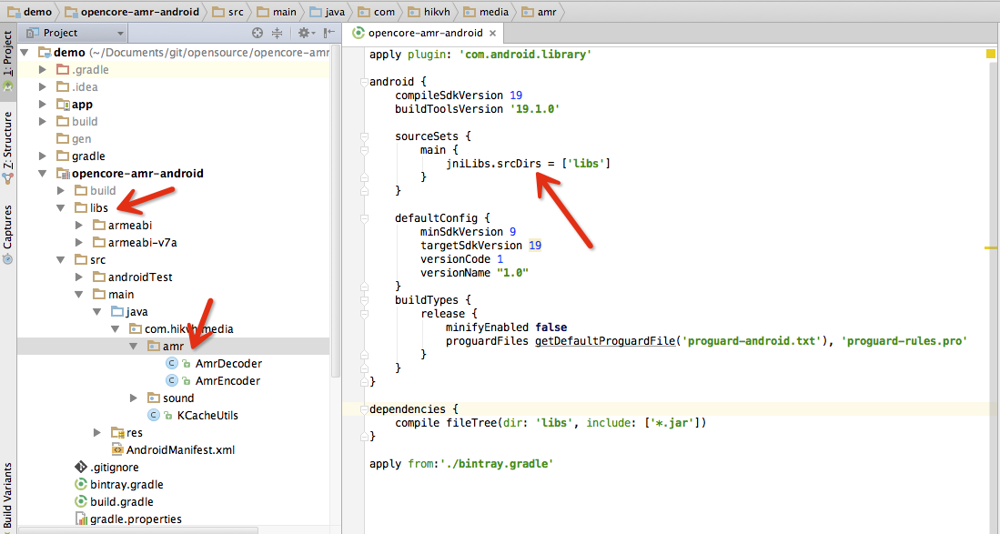

opencore-amr-android
====================

An opencore amr codec JNI wrapper with explanation,
And one solution for packaging amr audio files.

### 中文文档请移步[README_CN](README_CN.md)
## QQ tribe for help: 453503476

## Background
- [opencore][1] is the multimedia framework of android, which is a originallly contributed by PacketVideo.
- [amr][2] is abbreviation for Adaptive Multi-Rate audio codec, which is an audio compression format optimized for speech coding.
- [opencore-amr][3] is extracted from opencore as an codec for amr<->pcm encode/decode

## What Is This
- opencore-amr-dndroid is a wrapper for handy usage. You can usage wrapped api in Android Application without any troubles of writing c++ wrapper or ndk mk file.
- amr project offer a solution for packaging amr audio files, in elegant code structure.

## Setup
### Android Studio

* Add jcenter as your repository in project's build.gradle:
  
  ```
  allprojects {
        repositories {
            jcenter()//this is the default setting
        }
      }
  ```
* Add dependency in your module's build.gradle:  
  
  ```
  dependencies {
        compile fileTree(dir: 'libs', include: ['*.jar'])
        compile 'io.kvh:amr:1.1.1'//this is the lib
  }
  ```

  OR: Copy the content if [Codec/amr](Codec/amr) to your module, as follows:

  

### ADT(Eclipse)
  Copy the content if [Codec/amr](Codec/amr) to your project:
  > Copy content of libs and src to the corresponding folder

## Quick Start Up

* encode

``` 
AmrEncoder.init(0);

int mode = AmrEncoder.Mode.MR122.ordinal();
short[] in = new short[160];//short array read from AudioRecorder, length 160
byte[] out = new byte[32];//output amr frame, length 32
int byteEncoded = AmrEncoder.encode(mode, in, out);

AmrEncoder.exit();        
```
* decode

```
long state = AmrDecoder.init();

byte[] amrframe = new byte[32];//amr frame 32 bytes
short[] pcmframs = new short[160];//pcm frame 160 shorts
AmrDecoder.decode(state, amrframe, pcmframs);

AmrDecoder.exit(state);
```

## Packaging amr audio to file system
> record->encode->package amr file->upload(not implemented)

Audio steam is packaged to file in slices, the slice last a few seconds(customizable). This policy is suitable for this scenario: client is under unstable mobile network, client records amr file, sends slice by slice, server re-assembles the slices.

If you are interested in this solution, please refer to [Codec/app](Codec/app)

## Milestone
#### v1.2.0 April-15-2015
- format converter for amr/wav
- test cases

## Changelog

#### v1.1.1 2016-04-05
- fix decoding bug of 32bit

### v1.1.0 2016-04-02
- add prebuilds for all archs
- rename package

## FAQ
Please edit the FAQ files to help others, thanks! (赠人玫瑰，手留余香)

[FAQ_CN](FAQ_CN.md)

[FAQ](FAQ.md)

  [1]: https://github.com/android/platform_external_opencore
  [2]: http://en.wikipedia.org/wiki/Adaptive_Multi-Rate_audio_codec
  [3]: http://opencore-amr.sourceforge.net/
